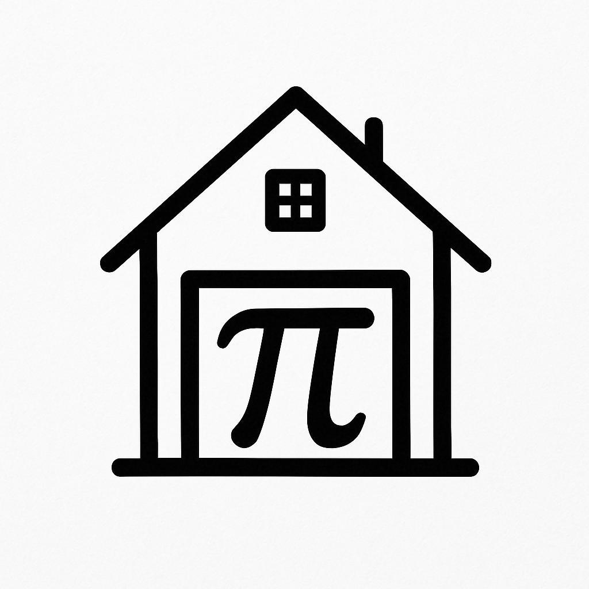

<!-- Improved compatibility of back to top link: See: https://github.com/othneildrew/Best-README-Template/pull/73 -->
<a id="readme-top"></a>
<!--
*** Thanks for checking out the Best-README-Template. If you have a suggestion
*** that would make this better, please fork the repo and create a pull request
*** or simply open an issue with the tag "enhancement".
*** Don't forget to give the project a star!
*** Thanks again! Now go create something AMAZING! :D
-->


<!-- PROJECT SHIELDS -->
<!--
*** I'm using markdown "reference style" links for readability.
*** Reference links are enclosed in brackets [ ] instead of parentheses ( ).
*** See the bottom of this document for the declaration of the reference variables
*** for contributors-url, forks-url, etc. This is an optional, concise syntax you may use.
*** https://www.markdownguide.org/basic-syntax/#reference-style-links
-->
[![Contributors][contributors-shield]](contributors-url)
[![Forks][forks-shield]][forks-url]
[![Stargazers][stars-shield]][stars-url]
[![Issues][issues-shield]][issues-url]
[![project_license][license-shield]][license-url]
[![LinkedIn][linkedin-shield]][linkedin-url]


<!-- PROJECT LOGO -->

<br />
<div align="center">
  <a href="https://github.com/AixNPanes/ha_mqtt_pi_smbus">
    
  </a>

<h3 align="center">Home Assistant MQTT discovery client for SMBus on Raspberry PI</h3>

  <p align="center">
This project is an MQTT discovery client for Home Assistant. It exposes a device with multiple sensors using SMBus I2C protocol on Raspberry PI. An example is provided which uses the Bosch BME280 temperature/pressure/humidity sensor device.
    <br />
    <a href="https://github.com/AixNPanes/ha_mqtt_pi_smbus"><strong>Explore the docs »</strong></a>
    <br />
    <br />
    <a href="https://github.com/AixNPanes/ha_mqtt_pi_smbus">View Demo</a>
    &middot;
    <a href="https://github.com/AixNPanes/ha_mqtt_pi_smbus/issues/new?labels=bug&template=bug-report---.md">Report Bug</a>
    &middot;
    <a href="https://github.com/AixNPanes/ha_mqtt_pi_smbus/issues/new?labels=enhancement&template=feature-request---.md">Request Feature</a>
  </p>
</div>


<!-- TABLE OF CONTENTS -->
<details>
  <summary>Table of Contents</summary>
  <ol>
    <li>
      <a href="#about-the-project">About The Project</a>
    </li>
    <li>
      <a href="#getting-started">Getting Started</a>
      <ul>
        <li><a href="#prerequisites">Prerequisites</a></li>
        <li><a href="#installation">Installation</a></li>
      </ul>
    </li>
    <li><a href="#usage">Usage</a></li>
    <li><a href="#roadmap">Roadmap</a></li>
    <li><a href="#contributing">Contributing</a></li>
    <li><a href="#license">License</a></li>
    <li><a href="#contact">Contact</a></li>
    <li><a href="#acknowledgments">Acknowledgments</a></li>
  </ol>
</details>


<!-- ABOUT THE PROJECT -->
## About The Project

[![Product Name Screen Shot][product-screenshot]](https://example.com)


<p align="right">(<a href="#readme-top">back to top</a>)</p>


<!-- GETTING STARTED -->
## Getting Started

This is an example of how you may give instructions on setting up your project locally.
To get a local copy up and running follow these simple example steps.

### Prerequisites

- A Raspberry Pi processor (models Zero through 5 should work)
- Network connection 
- Raspian OS installed and operational
- Python Version: 3.11+
- Python Dependencies:
  - flask
  - paho-mqtt
  - psutil
  - pyyaml
  - RPi.bme280

### Installation

1. Clone the repo
   ```sh
   git clone https://github.com/AixNPanes/ha_mqtt_pi_smbus.git
   ```
2. Change directory to ha_mqtt_pi_smbus
   ```sh
   cd ha_mqtt_pi_smbus
   ```
3. Build a python virtual env (change the name from myvenv to a virtual environment name of your choice
   ```sh
   python3 -m venv myvenv
   ```
4. Install prerequisites
   ```sh
   pip install -r requirements.txt
   ```
4. Activate the virtual environment (do this each time you start a shell (or terminal session)
   ```sh
   source venv/bin/activate
   ```
5. Configure the BME280 example
  a. In .config.yaml, change the following mqtt parameters: broker, username, password (note: you may place confidential information in .secrets.yaml and it will override information in .config.yaml)

6. Run the example
   ```
   python -m example.ha_mqtt_pi_tph280
   ```
7. Start a web browser
   a. Connect to port 8088 on the server running the sample program
   b. Click the MQTT Connection State: button to connect the client to Home Assistant's MQTT broker
   c. Wait until connection is complete (about 10 seconds on my systems), then click the Discovery State: button to send publish discovery messages
   d. Wait until discovery is complete

8. In the Home Assistant GUI, go to Settings -> Devices and Services -> Devices and enter 280 in the filter and click on the device

9. You should see 3 sensors: Temperature, Pressure, and Humidity. The values may start with 'Unknown' but at least within 3 minutes should show values.

10. You can click the UnDiscovery and Disconnect buttons to remove the device from Home Assistant.

11. When you are finished, hit Ctrl-C on the terminal session running the example.ha_mqtt_pi_tph280 python module. If the device has not yet been disconnected, UnDiscovery will be initiated and MQTT will be disconnected and the application will shut down normally.

12. You should not just kill the python program as this will not properly clean the device and sensors in Home Assistant. If this happens, just start the module again, connect, and discover as before, then hit Ctrl-C and cleanup should happen. Wait until discovery is complete. In the Home Assistant GUI, go to Settings -> Devices and services -> Devices

<p align="right">(<a href="#readme-top">back to top</a>)</p>


<!-- USAGE EXAMPLES -->
## Usage

The provided example provides support for the Bosch BME280 environmental sensor.

Additionally, other sensors utilizing SMBus support of the I2C bus should be fairly easily implemented.
 
1. Copy the example folder to a myproject folder
2. In myproject/device.py add a subclass for each sensor (mine are Temperature, Pressure, and Humidity). These class names converted to lower case become the names of the sensors in Home Assistant. The parameters for __init__ for each class are the user-supplied name for the sensor, the units string (use the units provided by the sensor, not Home Assistant, however the possible values for the sensor type must be valid Home Assistant values), the vendor name for the sensor device, the model name for the sensor.
3. Replace the class BME280_Device, in the __init__() method place a list or the sensor objects
4. Replace the class BME280 which implements the actual device interface. In the __init__ method, change the default bus and address defaults as required. Also, my device requires calibration, so I put that code in __init__. The sample method reads the data from the physical sensor and saves in in the object. The data method takes the data from the object and forms a dictionary which will be formatted with json and sent to Home Assistant as a data message.
5. The sensor data will be sampled every minute and will be used by MQTT shortly after it is sampled.
6. In myproject/parsing.py format any yaml/cmdline configuration you need to change.
7. In myproject/ha_mqtt_pi_tph280.py, change the imports to point to myproject rather than exmple. Change the bme280 and device variable initializations to match your changes in myproject/device.py. Change the MQTTClient initialization to have your device name and the device and bme280 variables if you changed the names of the variables earlier in the module.
8. Note: the route variable in each method is used only in logging. It probably doesn't need to be changed except in myproject/device.py if you change a method name.

_For more examples, please refer to the [Documentation](https://example.com)_

<p align="right">(<a href="#readme-top">back to top</a>)</p>


<!-- ROADMAP -->
## Roadmap

- [ ] Feature 1
- [ ] Feature 2
- [ ] Feature 3
    - [ ] Nested Feature

See the [open issues](https://github.com/AixNPanes/ha_mqtt_pi_smbus/issues) for a full list of proposed features (and known issues).

<p align="right">(<a href="#readme-top">back to top</a>)</p>


<!-- CONTRIBUTING -->
## Contributing

Contributions are what make the open source community such an amazing place to learn, inspire, and create. Any contributions you make are **greatly appreciated**.

If you have a suggestion that would make this better, please fork the repo and create a pull request. You can also simply open an issue with the tag "enhancement".
Don't forget to give the project a star! Thanks again!

1. Fork the Project
2. Create your Feature Branch (`git checkout -b feature/AmazingFeature`)
3. Commit your Changes (`git commit -m 'Add some AmazingFeature'`)
4. Push to the Branch (`git push origin feature/AmazingFeature`)
5. Open a Pull Request

<p align="right">(<a href="#readme-top">back to top</a>)</p>

### Top contributors:

<a href="https://github.com/AixNPanes/ha_mqtt_pi_smbus/graphs/contributors">
  
</a>


<!-- LICENSE -->
## License

Distributed under the project_license. See `LICENSE.txt` for more information.

<p align="right">(<a href="#readme-top">back to top</a>)</p>


<!-- CONTACT -->
## Contact

Tim Daley - [@AixNPanes](https://twitter.com/AixNPanes) - timdaley@earthling.net.com

Project Link: [https://github.com/AixNPanes/ha_mqtt_pi_smbus](https://github.com/AixNPanes/ha_mqtt_pi_smbus)

<p align="right">(<a href="#readme-top">back to top</a>)</p>


<!-- ACKNOWLEDGMENTS -->
## Acknowledgments

* []()
* []()
* []()

<p align="right">(<a href="#readme-top">back to top</a>)</p>


<!-- MARKDOWN LINKS & IMAGES -->
<!-- https://www.markdownguide.org/basic-syntax/#reference-style-links -->
[contributors-shield]: https://img.shields.io/github/contributors/AixNPanes/ha_mqtt_pi_smbus.svg?style=for-the-badge
[contributors-url]: https://github.com/AixNPanes/ha_mqtt_pi_smbus/graphs/contributors
[forks-shield]: https://img.shields.io/github/forks/AixNPanes/ha_mqtt_pi_smbus.svg?style=for-the-badge
[forks-url]: https://github.com/AixNPanes/ha_mqtt_pi_smbus/network/members
[stars-shield]: https://img.shields.io/github/stars/AixNPanes/ha_mqtt_pi_smbus.svg?style=for-the-badge
[stars-url]: https://github.com/AixNPanes/ha_mqtt_pi_smbus/stargazers
[issues-shield]: https://img.shields.io/github/issues/AixNPanes/ha_mqtt_pi_smbus.svg?style=for-the-badge
[issues-url]: https://github.com/AixNPanes/ha_mqtt_pi_smbus/issues
[license-shield]: https://img.shields.io/github/license/AixNPanes/ha_mqtt_pi_smbus.svg?style=for-the-badge
[license-url]: https://github.com/AixNPanes/ha_mqtt_pi_smbus/blob/master/LICENSE.txt
[linkedin-shield]: https://img.shields.io/badge/-LinkedIn-black.svg?style=for-the-badge&logo=linkedin&colorB=555
[linkedin-url]: https://linkedin.com/in/tim-daley-96226036
[product-screenshot]: images/screenshot.png
[Next.js]: https://img.shields.io/badge/next.js-000000?style=for-the-badge&logo=nextdotjs&logoColor=white
[Next-url]: https://nextjs.org/
[React.js]: https://img.shields.io/badge/React-20232A?style=for-the-badge&logo=react&logoColor=61DAFB
[React-url]: https://reactjs.org/
[Vue.js]: https://img.shields.io/badge/Vue.js-35495E?style=for-the-badge&logo=vuedotjs&logoColor=4FC08D
[Vue-url]: https://vuejs.org/
[Angular.io]: https://img.shields.io/badge/Angular-DD0031?style=for-the-badge&logo=angular&logoColor=white
[Angular-url]: https://angular.io/
[Svelte.dev]: https://img.shields.io/badge/Svelte-4A4A55?style=for-the-badge&logo=svelte&logoColor=FF3E00
[Svelte-url]: https://svelte.dev/
[Laravel.com]: https://img.shields.io/badge/Laravel-FF2D20?style=for-the-badge&logo=laravel&logoColor=white
[Laravel-url]: https://laravel.com
[Bootstrap.com]: https://img.shields.io/badge/Bootstrap-563D7C?style=for-the-badge&logo=bootstrap&logoColor=white
[Bootstrap-url]: https://getbootstrap.com
[JQuery.com]: https://img.shields.io/badge/jQuery-0769AD?style=for-the-badge&logo=jquery&logoColor=white
[JQuery-url]: https://jquery.com 
